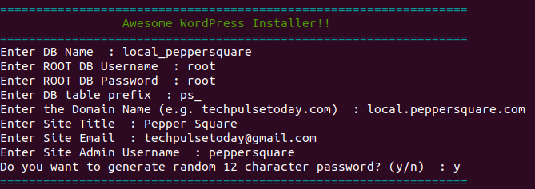

# wordpress-installer
WordPress installation script Assignment for Pepper Square



## Download the script

```shell
wget --no-check-certificate --content-disposition https://github.com/techpulsetoday/wordpress-installer/raw/master/wordpress-installer.sh -P ~/
```

## Make sure the script is executable

```shell
chmod a+x ~/wordpress-installer.sh
```

## Run the script

```shell
./wordpress-installer.sh
```
===================================== OR =======================================

## Execute bash script directly from a URL
```
bash <(curl -Ls https://raw.githubusercontent.com/techpulsetoday/wordpress-installer/master/wordpress-installer.sh)
```

## Example

```
=================================================================
                 Awesome WordPress Installer!!                  
=================================================================
Enter DB Name  : local_peppersquare
Enter ROOT DB Username  : root
Enter ROOT DB Password  : root
Enter DB table prefix  : ps_
Enter the Domain Name (e.g. techpulsetoday.com)  : local.peppersquare.com
Enter Site Title  : Pepper Square
Enter Site Email  : techpulsetoday@gmail.com
Enter Site Admin Username  : peppersquare
Do you want to generate random 12 character password? (y/n)  : y
=================================================================

```
